# EasyRecrui
## 「Easy求人」

SpringBootフレームワークを用いた「Easy求人」という求人サイトを新規作成しました。当サイトは仕事探し、求人、ユーザ管理などの機能が付きます。
開発の期間は約6ヶ月でした。

機能一覧は以下となります
<table>
   <tr>
      <th width="75">区分</th>
      <th width="95">機能</th>
      <th width="160" colspan="2">子機能/状態</th>
      <th width="">機能概要</th>
   </tr>
   <tr>
      <td rowspan="4"></td>
      <td rowspan="2">ログイン</td>
      <td colspan="2">成功</td>
      <td>sessionを保存し、メイン画面に遷移する</td>
   </tr>
   <tr>
      <td colspan="2">失敗</td>
      <td>ログイン失敗し、バックエンド画面をインタセプトする</td>
   </tr>
   <tr>
      <td rowspan="2">パスワード忘れ</td>
      <td colspan="2">情報入力</td>
      <td>個人情報が正しければパスワードを電話番号に変更、間違ったら「情報ただしくない」と表示</td>
   </tr>
   <tr>
      <td colspan="2">運営に連絡</td>
      <td>連絡内容を編集し、管理員に送る</td>
   </tr>
   <tr>
     <td rowspan="5">未登録</td>
      <td rowspan="4">仕事詳細</td>
      <td colspan="2">求人一覧</td>
      <td>カテゴリ、正社員、アルバイトでメイン画面からチェックできる</td>
   </tr>
   <tr>
      <td rowspan="2">求人検索</td>
      <td>会社名で</td>
      <td>求人情報を会社名のキーワードで検索し、更新時間の新しい順で表示する</td>
   </tr>
   <tr>
      <td>職位で</td>
      <td>求人情報をタイトルのキーワードで検索し、更新時間の新しい順で表示する</td>
   </tr>
   <tr>
      <td colspan="2">求人詳細</td>
      <td>求人情報詳細を見る</td>
   </tr>
   <tr>
      <td>企業ページ見る</td>
      <td colspan="2">企業情報</td>
      <td>求人詳細から閲覧できる</td>
   </tr>
   <tr>
      <td rowspan="17" >ユーザ</td>
      <td rowspan="2">登録</td>
      <td colspan="2">ユーザすでに存在</td>
      <td>「ユーザはすでに存在しました」と提示する</td>
   </tr>
   <tr>
      <td colspan="2">ユーザ存在しない</td>
      <td>登録成功し、ログイン画面に戻る</td>
   </tr>
   <tr>
      <td rowspan="5">情報管理</td>
      <td colspan="2">個人情報を編集</td>
      <td>個人情報を編集、保存する</td>
   </tr>
   <tr>
      <td colspan="2">アイコンを変更</td>
      <td>アイコン選択し保存する</td>
   </tr>
   <tr>
      <td rowspan="2">パスワード変更</td>
      <td>正しい</td>
      <td>パスワードを変更し、ログイン画面に遷移する</td>
   </tr>
   <tr>
      <td>間違い</td>
      <td>「パスワード正しくありません」と表示する</td>
   </tr>
   <tr>
      <td colspan="2">退会</td>
      <td>確認提示を「はい」と押したら、ユーザを削除し、メイン画面に遷移する</td>
   </tr>
   <tr>
      <td rowspan="8">履歴書</td>
      <td colspan="2">履歴書情報編集</td>
      <td>基本情報を編集、保存する</td>
   </tr>
   <tr>
      <td colspan="2">写真を編集</td>
      <td>履歴書の写真を選択、保存する</td>
   </tr>
   <tr>
      <td rowspan="3">学歴</td>
      <td>学歴追加</td>
      <td>学歴を追加する</td>
   </tr>
   <tr>
      <td>学歴編集</td>
      <td>学歴を編集、保存する</td>
   </tr>
   <tr>
      <td>学歴削除</td>
      <td>学歴を削除する</td>
   </tr>
   <tr>
      <td rowspan="3">職歴</td>
      <td width="95">職歴追加</td>
      <td>職歴を追加する</td>
   </tr>
   <tr>
      <td>職歴編集</td>
      <td>職歴を編集、保存する</td>
   </tr>
   <tr>
      <td>職歴削除</td>
      <td>職歴を削除する</td>
   </tr>
   <tr>
      <td rowspan="2">応募</td>
      <td colspan="2">履歴書の提出</td>
      <td>求人情報に履歴書を提出する</td>
   </tr>
   <tr>
      <td colspan="2">提出した履歴書をチェック</td>
      <td>提出した履歴書一覧と企業の返事（可否）を見る</td>
   </tr>
   <tr>
      <td  rowspan="10">企業</td>
      <td rowspan="2">企業登録</td>
      <td colspan="2">ユーザすでに存在</td>
      <td>「ユーザはすでに存在しました」と提示する</td>
   </tr>
   <tr>
      <td colspan="2">ユーザ存在しない</td>
      <td>登録成功し、ログイン画面に戻る</td>
   </tr>
   <tr>
      <td rowspan="3">企業情報</td>
      <td colspan="2">企業情報編集</td>
      <td>企業情報を編集、保存する</td>
   </tr>
   <tr>
      <td colspan="2">企業のアイコンを編集</td>
      <td>アイコンを編集、保存する</td>
   </tr>
   <tr>
      <td colspan="2">企業写真追加</td>
      <td>複数の写真を追加、編集する</td>
   </tr>
   <tr>
      <td rowspan="5">求人情報</td>
      <td colspan="2">求人発表</td>
      <td>カテゴリを選択し、求人情報を発表する</td>
   </tr>
   <tr>
      <td colspan="2">求人内容編集</td>
      <td>発表した求人情報を編集、保存する</td>
   </tr>
   <tr>
      <td colspan="2">発表内容削除</td>
      <td>発表した求人情報を削除する</td>
   </tr>
   <tr>
      <td rowspan="2">もらった求人</td>
      <td>承諾</td>
      <td>応募者に「会社に連絡してください」と表示</td>
   </tr>
   <tr>
      <td>拒否</td>
      <td>応募者に「残念、頑張ってください」と表示</td>
   </tr>
   <tr>
      <td  rowspan="7">管理員</td>
      <td rowspan="2">ユーザ管理</td>
      <td colspan="2">ユーザ資料編集</td>
      <td>ユーザの資料を編集、保存、履歴書をチェック、アカウントを制限する</td>
   </tr>
   <tr>
      <td colspan="2">ユーザ削除</td>
      <td>ユーザのアカウントを削除する</td>
   </tr>
   <tr>
      <td rowspan="3">企業管理</td>
      <td colspan="2">企業資料編集</td>
      <td>企業の資料を編集、保存、アカウントを制限する</td>
   </tr>
   <tr>
      <td colspan="2">企業ユーザ削除</td>
      <td>企業ユーザを削除する</td>
   </tr>
   <tr>
      <td colspan="2">求人情報を削除</td>
      <td>求人情報をチェック、削除する</td>
   </tr>
   <tr>
      <td rowspan="2">パスワード忘れ</td>
      <td colspan="2">承諾する</td>
      <td>ユーザのパスワードを変更し、別途で連絡する</td>
   </tr>
   <tr>
      <td colspan="2">拒否する</td>
      <td>変わりなし</td>
   </tr>
</table>

# 1．開発環境
1-1　IDE：Eclipse

1-2　OS：Windows7

1-3　JDK：Java8

1-4　フレームワーク：SpringBoot2.4.3

1-5　データベース：PostgreSQL

1-6　ソース管理：Github

1-7　テスト：Junit

1-8　テンプレートエンジン：Thymeleaf

1-9　画面：Html、JavaScript、jQuery、Ajax、Bootstrap

# 2．構成
画面遷移図
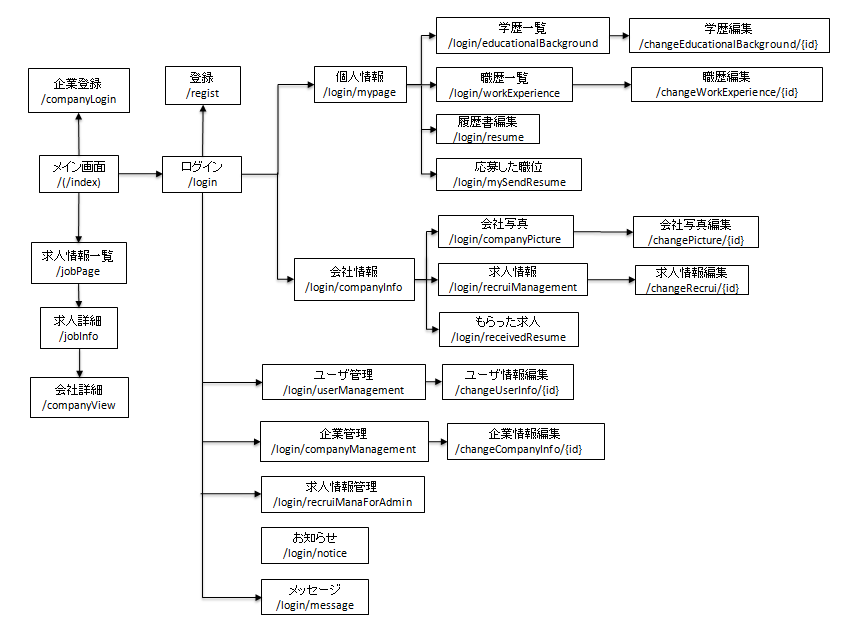

#### 2-1　ER図

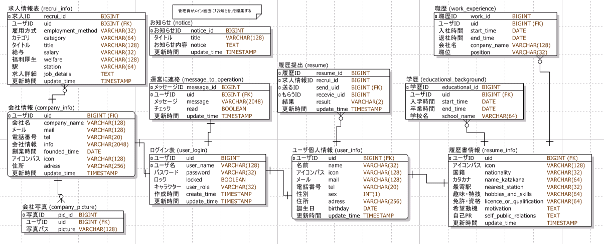

#### 2-2　システム構成

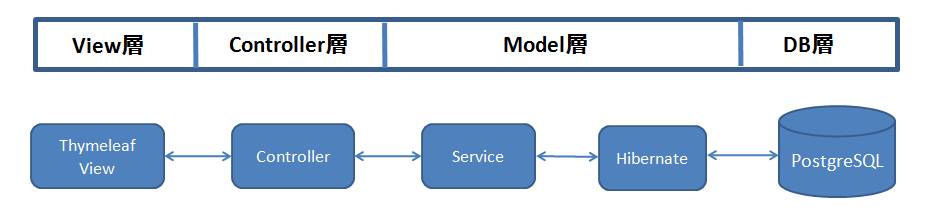

#### 2-3　キャラクター構成

当サイトは三つのキャラクターが設けられております：

##### 	①一般ユーザ：仕事を探す方

​	・個人情報を編集、パスワード変更

​	・履歴書の編集、一覧、学歴と職歴を追加、編集、削除する

​	・求人情報ページに履歴書の提出、提出した履歴書の結果を見る

​	・退会する

​	・カンパニーユーザになる

##### 　②ビジネスユーザ：求人する方

​	・会社情報編集、会社のイメージ写真の追加、編集、削除

​	・求人情報の追加、編集、削除

​	・一般ユーザからの応募の返事（可否のみ）、一般ユーザとして応募する

##### 　③管理員：一般ユーザ、ビジネスユーザ、求人情報を管理する方

​	・一般ユーザ、ビジネスユーザの情報編集、アカウント削除、制限する

​	・求人情報をチェック、削除する

​	・ホームページのお知らせを追加、編集、削除する

​	・ユーザパスワード忘れのリクエストを返事（新しいパスワード設定、拒否する）

# 3．画面

### 3-1　メイン画面

PC側でChromeでの表示

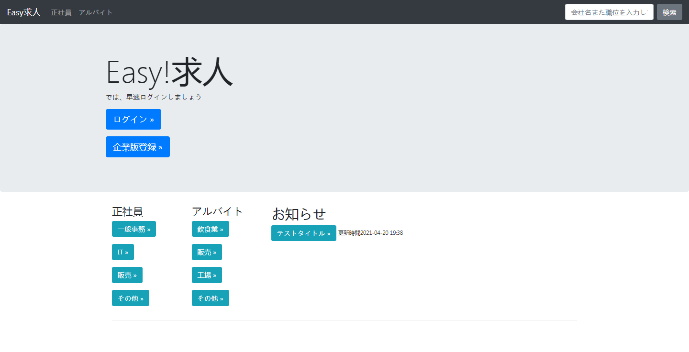

スマホ画面にも適応できます

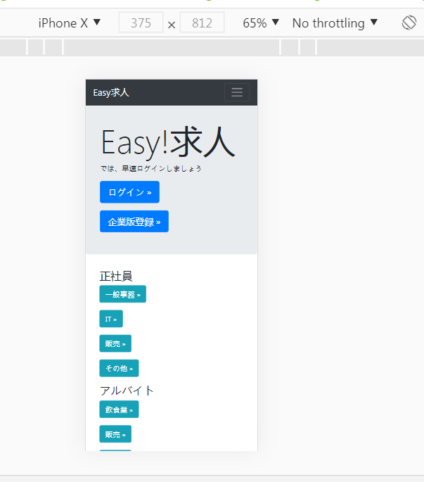

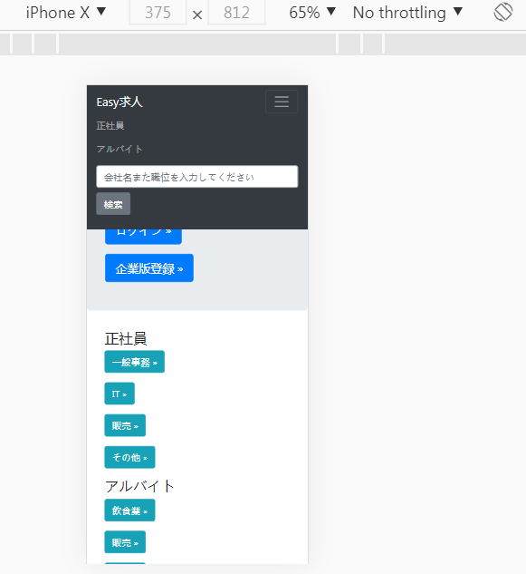

以下PC側の画面で表示します

### 3-2　ログイン画面

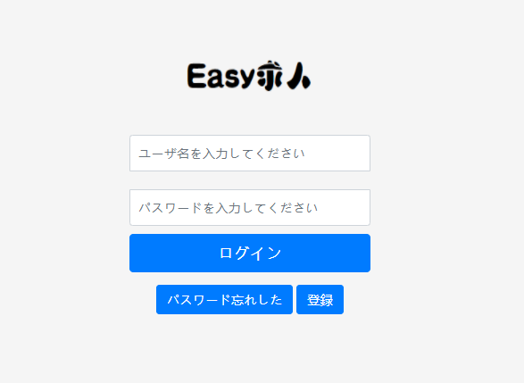

### 3-3　求人情報一覧、表示、会社情報画面

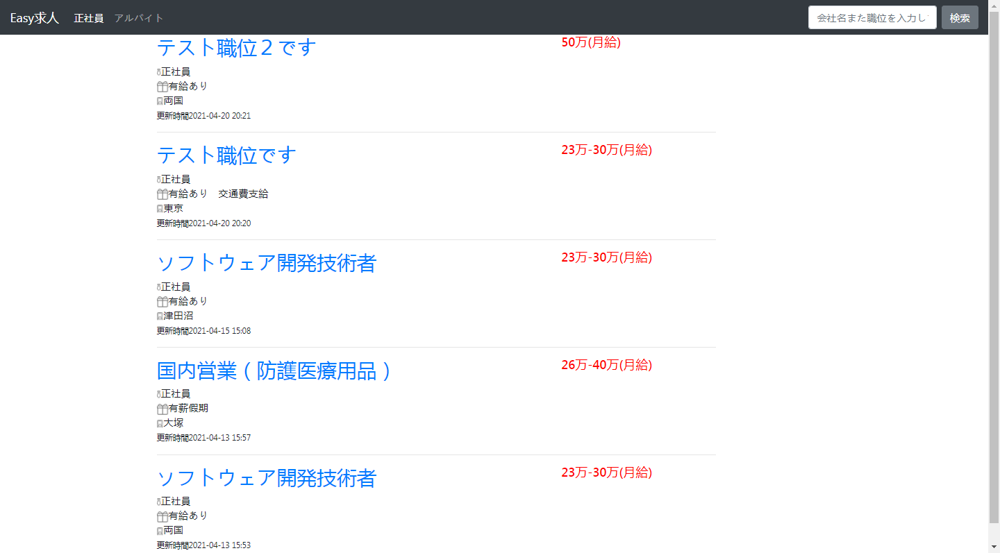

### 3-4　一般ユーザの管理画面

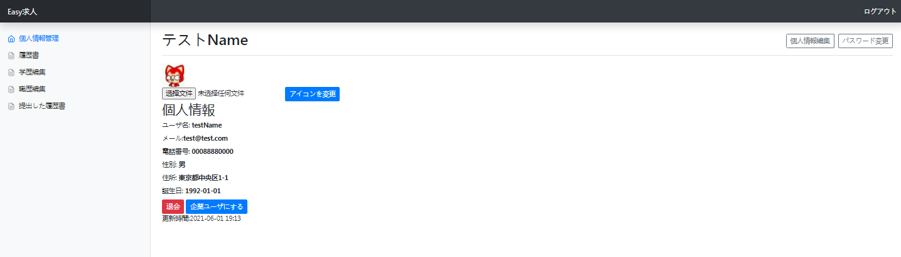

##### 履歴書一覧

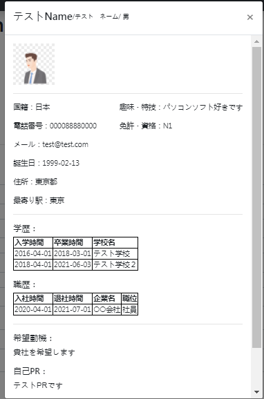

会社側も同じ画面が見えます

### 3-5　ビジネスユーザ画面

株式テスト会社を例とします

#### 会社情報編集

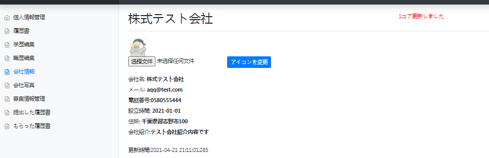

### 3-6　管理員画面

#### ユーザ管理画面

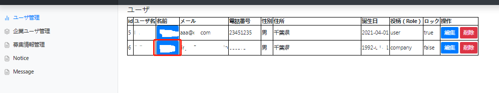

#### ③求人情報管理（募集情報管理）

タイトルをクリックしたら詳細を見ることができます

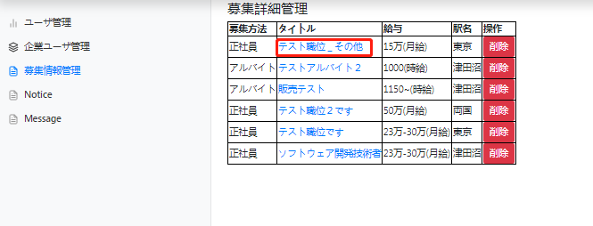

#### ④お知らせ画面（Notice）

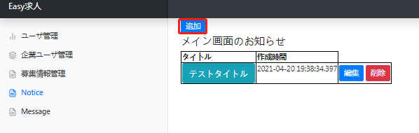

#### ⑤メッセージ（パスワード忘れのリクエスト）

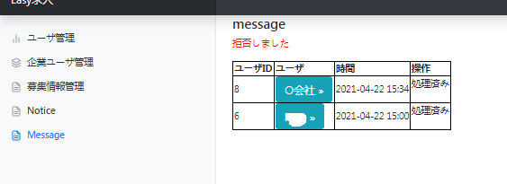

# 5．後ろ書き

 独学中の作品で、まだ足りない部分がありますが，これから開発に頑張りたいと思います。

また、記述ミスや間違いがあれば、ご遠慮なくご指摘ください。

